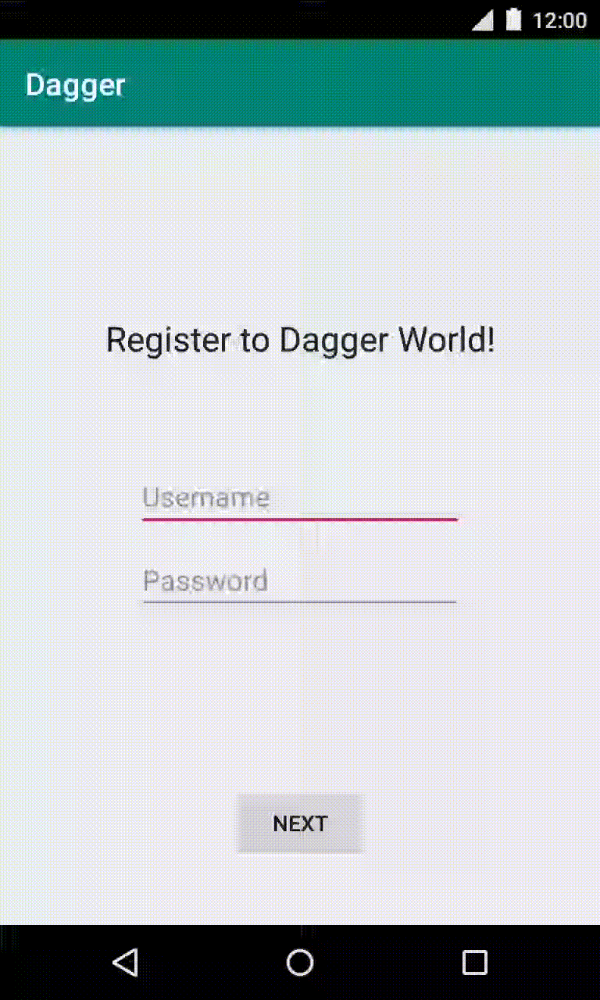

# Using Dagger in your Android app

[Google Codelab: Using Dagger in your Android app - Kotlin](https://codelabs.developers.google.com/codelabs/android-dagger/index.html)

## Introduction

Dependency injection is a technique widely used in programming and well suited
to Android development. By following the principles of dependency injection, you
lay the groundwork for a good app architecture.

Implementing dependency injection provides you with the following advantages:

* Reusability of code.
* Ease of refactoring.
* Ease of testing.

## Topics

* How to use Dagger in your Android app at scale.
* Relevant Dagger concepts to create a more solid and sustainable app.
* Why you might need Dagger subcomponents and how to use them.
* How to test your application that uses Dagger with unit and instrumentation tests.

## App Demo

